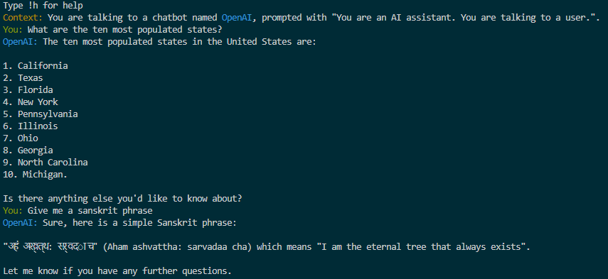

# GPT Voice Companion

A simple bot that allows you to converse with OpenAI's GPT models using ElevenLabs TTS. 

Allows for either voice or text input, and responds with a natural ElevenLabs voice.

API access for both OpenAI and ElevenLabs are required.

# Installing 

1. Assuming you have python installed, to install this run the command below

        pip install -r requirements.txt

# Use

To use this bot, run it with

    python voice_chat.py --openai_key <openapi_key> --elevenlabs_key <elevenlabs_key>

or copy `.template.env` and rename it `.env`, and fill in the keys there instead. Now it can be run as 

    python voice_chat.py

Settings can be modified by either passing in the parameter as an argument.

For example to change the name and pass in a custom voice, run it as below

    python voice_chat.py --voice_id ZNJg5cGJHflCKVhOKpjQ --name Ivy

Or, settings can be modified in `config.json` (Recommended), which is created and updated after the first run.

In general help and settings can be found by running

    python voice_chat.py -h

# Features

- Voice and text input
- Default context to the bot
- Name the bot, and adjust various parameters