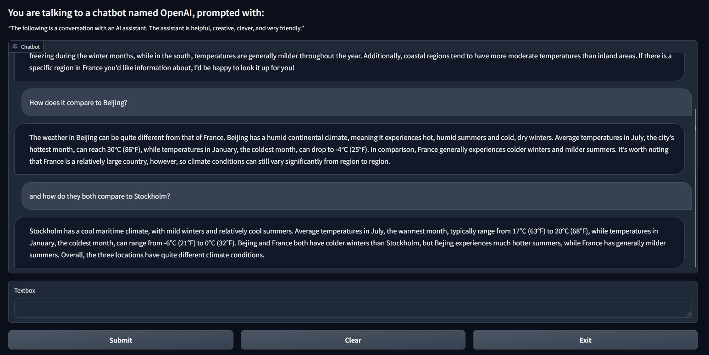
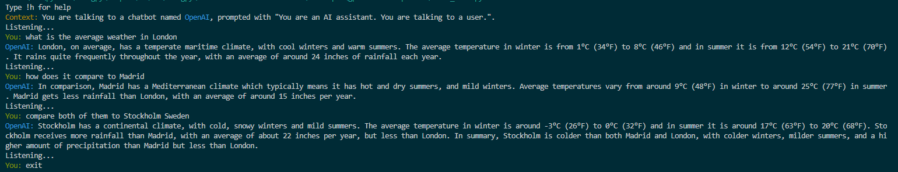

# GPT Voice Companion

GPT Voice Companion is an interactive chatbot leveraging OpenAI's GPT models and ElevenLabs TTS (Text-to-Speech) to create a seamless and engaging conversational experience. It supports both voice and text input, while providing responses through a natural-sounding ElevenLabs voice.

It can be used either through a GUI (graphical user interface), via gradio

or by running it through the CLI (command line interface)

To use this application, API access for both OpenAI and ElevenLabs is required.

# Installing 

1. Ensure you have Python installed. Then, install the required dependencies by running the following command:

        pip install -r requirements.txt

# Usage

You can start the chatbot by running the following command:

    python voice_chat.py --openai_key <openapi_key> --elevenlabs_key <elevenlabs_key>

Alternatively, copy the .template.env file, rename it to .env, and fill in the API keys. Now, you can run the chatbot using:

    python voice_chat.py

To launch the GUI, pass in the optional arguement `--gui`

    python voice_chat.py --gui

Settings can either be passed in as command-line arguments or by read from the config.json file (recommended). The configuration file is created and updated after the first run.

To view available options and settings, run:

    python voice_chat.py -h

# Features

- GUI via gradio
- Voice and text input support
- Customizable context for the chatbot
- Ability to name the chatbot and adjust various parameters
- Retry attempts for OpenAI API calls in case of errors or empty responses
- Audio and conversations are automatically saved in a designated folder